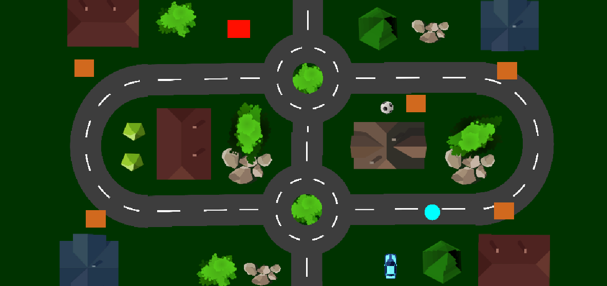

# 🚚 Delivery Driver



A top‑down car driving game where you play as a delivery driver! Pick up packages at brown markers, deliver them to the red point, and use blue boost zones to speed up.

---

## 🎮 Features

- **Easy Controls** — Arrow keys or W/A/S/D  
- **Pick‑up & Drop‑off System**  
  - 🟫 Brown markers = Pickup point  
  - 🟥 Red marker = Delivery point  
- **Speed Boosts** — Blue zones temporarily increase speed  
- **Fun Obstacles** — Navigate trees, rocks, houses, and roundabouts  

---

## 🕹️ Controls

| Action             | Keys                 |
| ------------------ | -------------------- |
| Steer Left/Right   | ← / → or A / D       |
| Accelerate/Brake   | ↑ / ↓ or W / S       |
| Toggle Fullscreen  | Alt + Enter          |
| Exit Game          | Esc or Alt + F4      |

---

## 🚀 Installation & Usage

1. **Clone the Repo**  
   ```bash
   git clone https://github.com/ASRafi41/Delivery-Driver.git
   cd Delivery-Driver
   ```

2. **In Unity Editor (2021+)**  
    - Open the project folder  
    - Go to **Edit → Project Settings → Player → Other Settings**  
    - Under **Active Input Handling**, select:  
      `Both` (or `Input System Package`)  
    - Press ▶️ Play to run the game

3. **Run Standalone Build (Windows)**  
    - Download ZIP 👉 [DeliveryDriver.zip](https://drive.google.com/file/d/1IpfA9gmf4r49uA35f103UATuXw4lL3nj/view?usp=sharing)  
    - Extract the ZIP  
    - Run `DeliveryDriver.exe`

4. **Watch Gameplay Demo**  
    🎥 [Demo Video](https://drive.google.com/file/d/1pk87vCHWzWtXrESC4DXuSbT95xbcwrEO/view?usp=sharing)

---

## 📁 Project Structure

```
Delivery-Driver/
├─ My project/
│  ├─ Assets/
│  │  ├─ Scenes/
│  │  │  └─ SampleScene.unity
│  │  ├─ Scripts/
│  │  │  ├─ Drive.cs
│  │  │  └─ Delivery.cs
│  │  └─ ...sprites, prefabs, etc.
│  ├─ ProjectSettings/
│  └─ Packages/
```

---

## ✅ Requirements

- Unity 2021 or newer
- Input System package enabled
- Windows (for standalone build)

---

## 🛠️ Technologies Used

- Unity Game Engine  
- C# Programming Language  
- Unity's Built‑in Physics System (Rigidbody2D, Colliders, Triggers)
